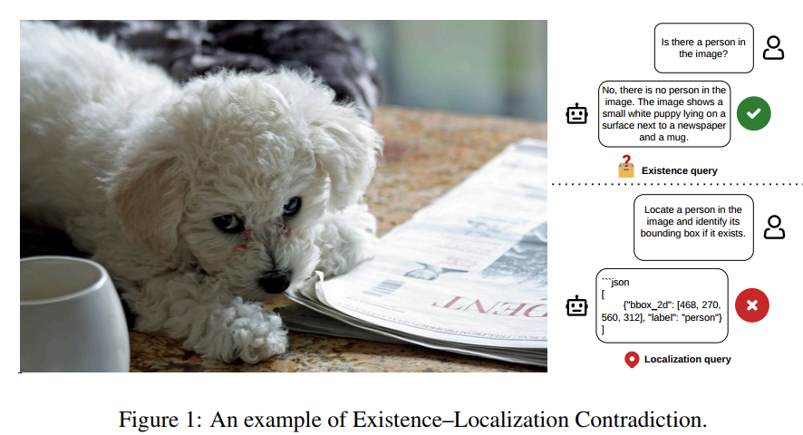

# Know It's Absent, Yet Point Anyway: Cross-Task Semantic Contradictions in Vision-Language Models

> **COMP4020 / COMP5040 – Natural Language Processing**  
> Course Project – Phase 2: Final Report & Code

## Overview

This repository contains the code, data specifications, and report for our NLP course project investigating **Existence–Localization Contradiction** in Vision-Language Models (VLMs).

We study a critical failure mode: a VLM correctly answers *"No"* when asked *"Is there a cat in the image?"*, yet still produces a bounding box when asked *"Point to the cat."* The model **knows** the object is absent but **acts** as if it is present — a semantic contradiction with dangerous implications for downstream systems (robotics, autonomous agents, medical localization).

<p align="center">
  
  <br>
  <em>Figure 1: Existence–Localization Contradiction — the model correctly denies a person's existence, then draws a bounding box for it anyway.</em>
</p>

## Team Members

| Name | Student ID | Role |
|:---|:---|:---|
| Nguyen Ba Thanh Bac | V202502001 | Preprocessing, Pipeline & Cross-Task Supervision |
| Nguyen Thi Tra My | V202502002 | Latent Space Probing & Visualization |
| Tran Thi Hoai Phuong | V202502962 | Activation Steering & Mitigation |

## Research Questions

Our investigation is structured around three core tasks:

1. **Task 1 — Evaluating Contradictions**: How often do state-of-the-art VLMs exhibit existence–localization contradictions across standard benchmarks?
2. **Task 2 — Latent Representation Probing**: Why do these contradictions occur? We analyze hidden-state geometry via PCA to understand the representational disconnect.
3. **Task 3 — Activation Steering Mitigation**: Can we steer model representations at inference time to restore consistency — without updating any model weights?

## Method

### Two-Stage Conditional Evaluation Protocol

For each image–object pair where the object is **absent**:

- **Stage 1 (Existence):** Ask the model *"Is there a {object}?"* → parse binary answer `ê ∈ {0, 1}`
- **Stage 2 (Localization):** Ask the model *"Locate the {object}"* → check if it returns a bounding box `l̂ ∈ {0, 1}`
- **Contradiction** = model correctly says absent (`ê = 0`) but still localizes (`l̂ = 1`)

### Evaluation Metrics

| Metric | Description |
|:---|:---|
| **EA** (Existence Accuracy) | Fraction of correct existence predictions |
| **NLP** (Null Localization Precision) | Fraction of null localizations that are truly absent objects |
| **CELF** (Conditional Existence–Localization Faithfulness) | P(null localization \| object absent AND model correctly said absent) — **our primary metric** |

### Lightweight Activation Steering

We compute a **steering vector** from contrastive paired outputs (hallucinated bbox vs. correct abstention) and inject it additively into hidden states at inference time:

```
s(l) = mean(h_abs) - mean(h_loc)  # steering direction
h̃(l) = h(l) + α · s(l)          # inference-time intervention
```

This is **parameter-free**, applied at a single transformer layer, and preserves localization performance on positive samples.

## Models & Benchmarks

**Models evaluated:**
- Qwen2.5-VL-7B-Instruct
- Qwen3-VL-8B-Instruct
- InternVL3-8B
- InternVL3.5-8B

**Benchmarks:**
- [POPE](https://github.com/AoiDragon/POPE) — Object presence evaluation on COCO
- [AMBER](https://github.com/junyangwang0410/AMBER) — Multi-dimensional hallucination benchmark
- [MME](https://github.com/BradyFU/Awesome-Multimodal-Large-Language-Models) — Object existence subset
- [DASH-B](https://github.com/maxaugusto/DASH) — Systematic hallucination detection

## Key Results

| Model | Type | POPE CELF | AMBER CELF | MME CELF | DASH-B CELF |
|:---|:---|:---:|:---:|:---:|:---:|
| Qwen2.5-VL-7B | Base | 10.4 | 28.6 | 20.0 | 2.8 |
| | **Steered** | **41.6** (+31.2) | **53.1** (+24.5) | **90.0** (+70.0) | **13.5** (+10.7) |
| Qwen3-VL-8B | Base | 15.8 | 38.2 | 50.0 | 2.7 |
| | **Steered** | **50.0** (+34.2) | **65.3** (+27.1) | **80.0** (+30.0) | **13.1** (+10.4) |
| InternVL3-8B | Base | 0.0 | 0.0 | 0.0 | 0.0 |
| | **Steered** | **72.9** (+72.9) | **55.0** (+55.0) | **76.7** (+76.7) | **53.3** (+53.3) |
| InternVL3.5-8B | Base | 0.0 | 0.0 | 0.0 | 0.0 |
| | **Steered** | **20.6** (+20.6) | **33.4** (+33.4) | **46.7** (+46.7) | **15.6** (+15.6) |

> Steering dramatically improves CELF (e.g., InternVL3-8B: **0% → 72.9%** on POPE) while preserving existence accuracy.

## Repository Structure

```
Project_NLP/
├── README.md                 # This file
├── data/
│   └── README.md             # Dataset descriptions, schemas, and download instructions
├── scripts/
│   └── build_report.py       # Report compilation script (Markdown → DOCX)
├── report/
│   ├── report.md             # Full report in Markdown
│   └── report.pdf            # Compiled PDF report
├── figures/
│   ├── figure1.png           # Contradiction example figure
│   ├── figure2.png           # PCA hidden-state projection
│   └── figure3.png           # Steering coefficient analysis
├── presentation/
│   ├── VLM_Contradictions_Presentation.tex  # Beamer presentation source
│   └── VLM_Contradictions_Presentation.pdf  # Compiled presentation slides
├── paper_text.txt            # Reference paper text
├── project_requirements.txt  # Course requirements specification
└── .gitignore
```

## Reproduction

### Prerequisites

- Python 3.10+
- PyTorch 2.0+
- Transformers (HuggingFace)
- [EasySteer](https://github.com/EasySteer/EasySteer) — for computing and injecting steering vectors

### Dataset Setup

Due to licensing and file size constraints, raw images are not included. To reproduce:

1. Download images from the official sources:
   - [MS COCO 2017 val](https://cocodataset.org/) (for POPE)
   - [AMBER](https://github.com/junyangwang0410/AMBER)
   - [MME](https://github.com/BradyFU/Awesome-Multimodal-Large-Language-Models)
   - [DASH-B](https://github.com/maxaugusto/DASH)
2. Place images in `data/images/`
3. See [`data/README.md`](data/README.md) for the unified data schema and format specification

### Running the Evaluation

The evaluation pipeline follows the two-stage conditional protocol:

1. **Stage 1** — Run existence queries on negative subsets and record model predictions
2. **Stage 2** — Run localization queries on the same samples and parse bounding-box outputs
3. **Compute metrics** — Calculate EA, NLP, and CELF from the paired predictions

### Steering Intervention

To apply activation steering:

1. Construct 100 contrastive pairs (hallucinated bbox vs. correct abstention)
2. Extract hidden states at target layers (layers 7–13)
3. Compute the mean difference vector as the steering direction
4. Inject at inference time with scaling coefficient α (see Appendix A in the report for model-specific configurations)

## Report

The full project report is available in [`report/report.pdf`](report/report.pdf). It covers:

- Problem definition and motivation
- Two-stage conditional evaluation protocol
- Baseline results across 4 models × 4 benchmarks
- PCA-based latent space analysis
- Activation steering methodology and results
- Prompt ablation study
- Pipeline reflection and team contributions

## References

- Li et al. (2023). *Evaluating Object Hallucination in Large Vision-Language Models.* EMNLP 2023.
- Wang et al. (2024). *AMBER: An LLM-Free Multi-Dimensional Benchmark for MLLMs Hallucination Evaluation.* arXiv:2311.07397.
- Fu et al. (2026). *MME: A Comprehensive Evaluation Benchmark for Multimodal Large Language Models.* NeurIPS Datasets & Benchmarks.
- Augustin et al. (2025). *DASH: Detection and Assessment of Systematic Hallucinations of VLMs.* arXiv:2503.23573.
- Su et al. (2025). *Activation Steering Decoding: Mitigating Hallucination in Large Vision-Language Models.* ACL 2025.
- Xu et al. (2025). *EasySteer: A Unified Framework for High-Performance and Extensible LLM Steering.* arXiv:2509.25175.

## License

This project is for academic purposes as part of COMP4020/COMP5040 coursework.