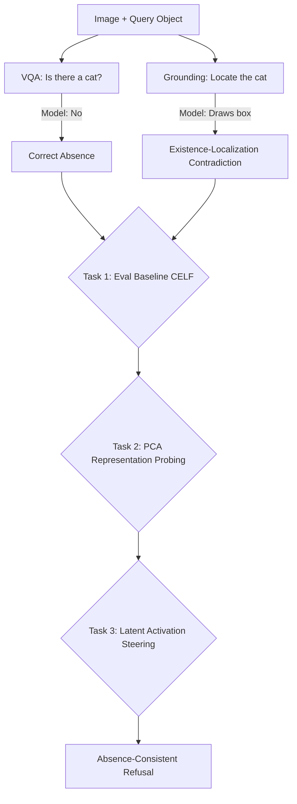
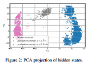
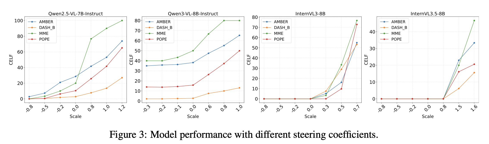
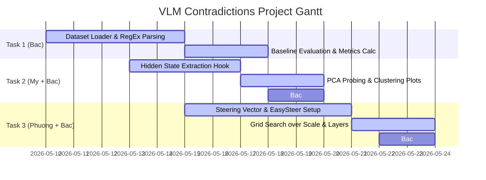

# Know It's Absent, Yet Point Anyway: Cross-Task Semantic Contradictions in Vision-Language Models

**Course Project Final Report (Phase 2)**  
**COMP4020 / COMP5040 – Natural Language Processing**  
**VinUniversity**

**Team Members & Contribution Roles:**
1. **Nguyen Ba Thanh Bac** (Student ID: V202502001) – *Role: Preprocessing, Pipeline Architecture & Cross-Task Supervision*
2. **Nguyen Thi Tra My** (Student ID: V202502002) – *Role: Latent Space Probing & Probing Visualization*
3. **Tran Thi Hoai Phuong** (Student ID: V202502962) – *Role: Activation Steering & Mitigation*

**GitHub Repository URL:** https://github.com/Phuongtran75/Project_NLP/tree/main

## 1. Introduction

### 1.1 Multimodal NLP and Spatial Grounding Task Definition
Recent breakthroughs in multimodal Natural Language Processing (NLP) have witnessed the convergence of generative reasoning and visual perception into unified Vision-Language Models (VLMs) (Liu et al., 2024; Team et al., 2025). Modern VLMs are no longer restricted to text-based Visual Question Answering (VQA) but are increasingly trained to support spatial grounding—connecting natural language referents to coordinates on the image, typically represented as points or 2D bounding boxes. Formally, given an image $v$ and a target query object $o$, the spatial grounding task requires the model to output a bounding box coordinate $b = [x_{min}, y_{min}, x_{max}, y_{max}]$ if the object $o$ is present, or return a null/abstention output $b = \emptyset$ if the object is absent from the scene.

This dual capability is crucial for downstream multimodal NLP agents. However, this paper focuses on a critical, systematic vulnerability in VLMs: the **Existence-Localization Contradiction**. This failure occurs when a VLM correctly determines at a semantic level that an object is *absent* from an image (e.g., answering "No" to the VQA prompt *"Is there a dog in the image?"*), but still draws a bounding box coordinate when later asked to ground the same absent object (e.g., drawing a box when prompted *"Locate the dog in the image"*). This represents a severe violation of logical coherence, posing critical safety risks in autonomous systems, robotics, and agentic workflows where spatial commitments trigger physical actions.


### 1.2 Dataset Origins and Description
To thoroughly evaluate the existence-localization contradiction, our project leverages four diverse benchmarks that focus on object-existence and visual hallucination:
* **POPE (Polite Object Presence Evaluation)** (Li et al., 2023b): Built on MS COCO, this benchmark queries models on the presence/absence of objects under random, popular, and adversarial settings. We isolate the negative subsets (absent objects).
* **AMBER (Object Existence Subset)** (Wang et al., 2024): A comprehensive benchmark evaluating multiple dimensions of VLM hallucinations. We extract its binary object presence queries and corresponding negative pairs.
* **MME (Object Existence Subset)** (Fu et al., 2026): A popular benchmark assessing VLM capabilities. We utilize the object existence subtask, selecting all negative query pairs.
* **DASH-B (Detection and Assessment of Systematic Hallucinations)** (Augustin et al., 2025): A benchmark designed to detect systematic hallucinations where VLMs hallucinate highly co-occurring but absent items (e.g., a fork next to a plate). It presents a challenging test of VLM abstention capability.

### 1.3 Motivation and Challenges
The core motivation of this project is to address the gap between a model's *perception* (what it semantically knows is in the scene) and its *operational commitment* (where it points). If a model knows an object is absent, drawing a bounding box is an **actionable hallucination** that propagates false evidence down a pipeline. 
The challenges are threefold:
1. **Representational Gap**: Spatial grounding and VQA are often treated as distinct task formats, leading to separate representational regimes within the model's layers.
2. **Abstention Deficit**: Strong open-source VLMs are heavily fine-tuned to *always* output coordinates when prompted, making them highly resistant to refuting/abstaining under grounding prompts.
3. **Inference Efficiency**: Mitigating these contradictions must not involve expensive parameter fine-tuning, which would degrade standard visual-grounding performance on positive samples.

## 2. Research Questions and NLP Tasks

Our investigation is structured around three core Research Questions (RQs) representing our three project sub-tasks:



### 2.1 Task 1: Evaluating the Prevalence of Existence-Localization Contradictions

#### 2.1.1 Introduction
The first question we address is: *To what extent do state-of-the-art VLMs suffer from existence-localization contradictions across standard benchmarks?* We must measure the frequency with which a model correctly identifies an object's absence but subsequently fails to preserve this judgment under a spatial grounding prompt.

#### 2.1.2 Approach & Methodology: The Two-Stage Conditional Protocol
We formulate a **2-Stage Conditional Evaluation Protocol** over a negative subset of image-object pairs $\mathcal{N} = \{(v_i, o_i) : e_i = 0\}$, where the ground-truth existence label $e_i$ is 0 (object is absent).
* **Stage 1 (Existence Recognition)**: The model is queried with an existence template $T_E(o_i)$ (e.g., *"Is there a {object} in the image?"*). The response is parsed into a binary existence prediction $\hat{e}_i \in \{0, 1\}$.
* **Stage 2 (Localization under Absence)**: The model is queried with a localization template $T_L(o_i)$ (e.g., *"Locate the {object} in the image"*). The response is parsed into a binary localization decision $\hat{\ell}_i \in \{0, 1\}$, where $\hat{\ell}_i = 1$ if the model returns a bounding box, and $\hat{\ell}_i = 0$ if the model abstains or returns a null output.

We define three core metrics to evaluate this behavior:
1. **Existence Accuracy (EA)**: The percentage of correct existence predictions on negative pairs:
$$\text{EA} = \frac{1}{|\mathcal{N}|} \sum_{i \in \mathcal{N}} \mathbb{I}(\hat{e}_i = 0)$$
2. **Null Localization Precision (NLP)**: The fraction of localization abstentions that occur on truly negative examples:
$$\text{NLP} = \frac{\sum_{i} \mathbb{I}(e_i = 0)\mathbb{I}(\hat{\ell}_i = 0)}{\sum_{i} \mathbb{I}(\hat{\ell}_i = 0)}$$
3. **Conditional Existence-Localization Faithfulness (CELF)**: The probability that the model abstains from localization, given that it correctly identified the object's absence:
$$\text{CELF} = \Pr(\hat{\ell}_i = 0 \mid e_i = 0, \hat{e}_i = 0) = \frac{\sum_{i \in \mathcal{N}} \mathbb{I}(\hat{e}_i = 0)\mathbb{I}(\hat{\ell}_i = 0)}{\sum_{i \in \mathcal{N}} \mathbb{I}(\hat{e}_i = 0)}$$
A CELF of $1.0$ represents perfect consistency, while $0.0$ represents a complete failure where the model always draws a hallucinated bounding box despite knowing the object is absent.

#### 2.1.3 Implementation & Code
The full evaluation pipeline is implemented in `notebooks/inference.ipynb`. The core preprocessing step involves extracting the queried object from each benchmark's existence prompt using regular expressions, and then constructing a corresponding localization prompt. Below is the regex-based object extraction used for POPE and the multi-modal message construction:

```python
# Object extraction from existence prompts (notebooks/inference.ipynb)
_PATTERN = re.compile(
    r"^Is there a(?:n)? (?P<object>.+?) in the image\\?$",
    re.IGNORECASE
)

def extract_object(sentence: str) -> Optional[str]:
    match = _PATTERN.match(sentence.strip())
    return match.group("object") if match else None

# Construct multi-modal input for the VLM
def process_message(image, prompt):
    messages = [
        {"role": "user", "content": [
            {"type": "image"},
            {"type": "text", "text": prompt},
        ]}
    ]
    return {
        "prompt": processor.apply_chat_template(
            messages, tokenize=False, add_generation_prompt=True),
        "multi_modal_data": {"image": [image]},
    }
```

For each benchmark, a dataset-specific extractor handles format differences (e.g., AMBER uses *"in this image"*, MME appends *"Please answer yes or no"*). The localization prompt is then constructed per model family: natural language for Qwen (*"Locate a/an {object} in the image and identify its bounding box if it exists"*) and `<ref>` tags for InternVL. The model's localization response is parsed for the presence of a bounding box coordinate to determine $\hat{\ell}_i$.

#### 2.1.4 Baseline Quantitative Results
We evaluate four state-of-the-art models: **Qwen2.5-VL-7B-Instruct**, **Qwen3-VL-8B-Instruct**, **InternVL3-8B**, and **InternVL3.5-8B** across POPE, AMBER, MME, and DASH-B.

| Model | Metric | POPE | AMBER | MME | DASH-B |
| :--- | :--- | :---: | :---: | :---: | :---: |
| **Qwen2.5-VL-7B-Instruct** | EA $\uparrow$<br>NLP $\uparrow$<br>**CELF** $\uparrow$ | 83.7%<br>94.7%<br>**10.4%** | 95.4%<br>100.0%<br>**28.6%** | 100.0%<br>100.0%<br>**20.0%** | 74.3%<br>100.0%<br>**2.8%** |
| **Qwen3-VL-8B-Instruct** | EA $\uparrow$<br>NLP $\uparrow$<br>**CELF** $\uparrow$ | 89.4%<br>95.2%<br>**15.8%** | 90.2%<br>100.0%<br>**38.2%** | 98.3%<br>100.0%<br>**50.0%** | 74.5%<br>100.0%<br>**2.7%** |
| **InternVL3-8B** | EA $\uparrow$<br>NLP $\uparrow$<br>**CELF** $\uparrow$ | 90.8%<br>0.0%<br>**0.0%** | 92.3%<br>0.0%<br>**0.0%** | 98.3%<br>0.0%<br>**0.0%** | 67.6%<br>0.0%<br>**0.0%** |
| **InternVL3.5-8B** | EA $\uparrow$<br>NLP $\uparrow$<br>**CELF** $\uparrow$ | 86.7%<br>0.0%<br>**0.0%** | 88.5%<br>0.0%<br>**0.0%** | 100.0%<br>0.0%<br>**0.0%** | 68.9%<br>0.0%<br>**0.0%** |

#### 2.1.5 Discussion & Insights
The quantitative results reveal a striking and systematic gap:
1. **The InternVL Abstention Crisis**: Both InternVL3-8B and InternVL3.5-8B obtain a **CELF of 0.0%** across all four datasets. This indicates that these models *never* abstain under a localization query. Even when they possess perfect VQA perception (e.g., 100% EA on MME), they draw bounding boxes 100% of the time when asked to point to the absent entity.
2. **Qwen's Moderate but Inadequate Consistency**: The Qwen family exhibits non-zero CELF scores, with Qwen3-VL reaching 50.0% on MME. However, on DASH-B, the CELF scores drop below 3.0% for both models, demonstrating that highly co-occurring absent distractors almost always override the models' semantic knowledge.
3. **Conclusion on Task 1**: High existence accuracy is entirely insufficient to guarantee faithful localization behavior. Models possess the semantic knowledge of absence but fail to carry it into spatial grounding tasks.

### 2.2 Task 2: Latent Representation Probing

#### 2.2.1 Introduction
Having established the prevalence of these contradictions, we investigate: *Why do existence-localization contradictions occur in the latent space of VLMs?* We probe the hidden states of Qwen2.5-VL-7B-Instruct to trace how information is organized when processing existence versus localization prompts.

#### 2.2.2 Approach & Dimensionality Reduction
For each test sample $i \in \mathcal{N}$, we extract the model's hidden activation vector $h^{(l)}_i \in \mathbb{R}^d$ at the final token position in layer $l = 15$ (a representative middle-to-late transformer layer). We collect activations under three experimental conditions:
1. **Existence Prompt Activations**: $H_{exist}$ (where the model answers "No").
2. **Localization Prompt Contradiction Activations**: $H_{loc\_box}$ (where the model incorrectly draws a bounding box for an absent object, $\hat{\ell} = 1$).
3. **Localization Prompt Faithfulness Activations**: $H_{loc\_null}$ (where the model correctly abstains or returns a null response, $\hat{\ell} = 0$).

We apply **Principal Component Analysis (PCA)** to project these high-dimensional hidden states onto a 2D plane for visual inspection.

#### 2.2.3 Implementation & Code
Hidden state extraction is implemented in `notebooks/create_hidden_state.ipynb`. We use EasySteer's `get_all_hidden_states_generate` function with vLLM to extract activations across all transformer layers, then isolate the last token position per sample:

```python
# Hidden state extraction (notebooks/create_hidden_state.ipynb)
import easysteer.hidden_states as hs
from vllm import LLM

llm = LLM(
    model="Qwen/Qwen2.5-VL-7B-Instruct",
    tensor_parallel_size=1,
    enforce_eager=True,
    enable_chunked_prefill=False,
    enable_prefix_caching=False
)

# Extract hidden states for all tokens
batch_hidden_states, outputs = hs.get_all_hidden_states_generate(llm, prompts)

# Keep only the last token's hidden state per layer
all_hidden_states = []
for hidden_state in batch_hidden_states:
    hidden_state_by_layers = []
    for layer in hidden_state:
        hidden_state_by_layers.append(layer[-1, :])  # Last token
    all_hidden_states.append(torch.stack(hidden_state_by_layers))
all_hidden_states = torch.stack(all_hidden_states)
torch.save(all_hidden_states.detach().cpu(), "hidden_states_tensor.pt")
```

The extracted tensors are then grouped by experimental condition (existence prompt, localization contradiction, localization faithfulness) and projected using `sklearn.decomposition.PCA` with `n_components=2`.

#### 2.2.4 Latent Space Analysis & Visual Interpretation
The PCA projection reveals two crucial topological properties:

```
[PCA Project of Hidden States]
      PC2 ^
          |      (Existence Prompt Cluster)
          |         [ * * * * * ]
          |        [  * * * *  ]
          |             \
          |              \  (Proximity Pathway)
          |               \
          |           [ o o o ]  (Correct Rejection Cluster: l=0)
          |          [ o o o o ]
          |
          |       [ x x x x x x ]
          |      [ x x x x x x x ] (Contradictory BBox Cluster: l=1)
          +---------------------------------------------> PC1
```

1. **Task Representation Separation**: There is a stark spatial division between existence query activations ($H_{exist}$) and localization query activations ($H_{loc\_box}$). This separation proves that the VLM enters completely different "representational regimes" based on prompt structure. Multi-task pretraining has failed to construct a unified concept of "object presence" that bridges semantic QA and spatial grounding.
2. **Proximity of Correct Rejections**: Critically, the hidden states of correct null-localizations ($H_{loc\_null}$) form a distinct sub-cluster that lies significantly closer to the VQA cluster ($H_{exist}$). When the model succeeds in abstaining, its internal representations are pulled towards the semantic existence regime, leveraging the knowledge that the object is absent to override the default grounding reflex.



#### 2.2.5 Discussion
This probing analysis confirms our hypothesis: Existence-localization contradictions are caused by a representational disconnect. Grounding prompts place the model in a localized coordinate-generating regime that is blind to the semantic presence-knowledge stored in the VQA regime. This motivates a latent-space intervention to steer the model towards the semantic absence cluster during grounding queries.

### 2.3 Task 3: Lightweight Activation Steering Mitigation

#### 2.3.1 Introduction
The third question is: *Can we causally steer the model's latent states at inference time to restore consistency without updating model weights?* Based on Task 2, we introduce a parameter-free, inference-time activation steering mechanism to push the model's grounding representations towards the faithful, absence-consistent regime.

#### 2.3.2 Approach & Mathematical Formulation
We construct a paired contrastive intervention set $\mathcal{P} = \{(v_i, o_i, q^L_i, y^{loc}_i, y^{abs}_i)\}_{i=1}^M$ of $M = 100$ examples. For each query, $y^{loc}_i$ represents a response containing a hallucinated bounding box, while $y^{abs}_i$ is the correct refusal response stating the object is absent. 
1. We run the VLM on both responses and extract hidden states at a chosen layer $l$. Let $h^{(l)}_{i,loc}$ and $h^{(l)}_{i,abs}$ denote the activations for the box and abstention responses, respectively.
2. We compute the contrastive difference vector for each sample:
$$\Delta h^{(l)}_i = h^{(l)}_{i,abs} - h^{(l)}_{i,loc}$$
3. We define the **steering vector** $s^{(l)}$ as the mean difference across the dataset:
$$s^{(l)} = \frac{1}{M} \sum_{i=1}^M \Delta h^{(l)}_i$$
This vector captures the linear direction in the latent space that encodes the shift from hallucination to faithful abstention.
4. At inference time, we additively inject the steering vector into the hidden representation at layer $l$:
$$\tilde{h}^{(l)} = h^{(l)} + \alpha s^{(l)}$$
where $\alpha \in \mathbb{R}$ is a scaling coefficient. We perform a grid search over layers $l \in [7, 13]$ and coefficients $\alpha$ to find the optimal configuration that maximizes CELF while preserving bounding-box accuracy on positive samples.

#### 2.3.3 Implementation & Code
Steering vector construction is implemented in `notebooks/create_steer_vectors.ipynb`, using EasySteer's `extract_diffmean_control_vector` function. The hidden states from contrastive pairs (hallucinated bounding-box response vs. correct abstention response) are loaded, and the DiffMean steering vector is computed:

```python
# Steering vector construction (notebooks/create_steer_vectors.ipynb)
from easysteer.steer import extract_diffmean_control_vector

all_hidden_states = torch.load("hidden_states_tensor.pt")
positive_indices = [i for i in range(all_hidden_states.shape[0]) if i % 2 == 1]  # Abstention
negative_indices = [i for i in range(all_hidden_states.shape[0]) if i % 2 == 0]  # Hallucination

control_vector = extract_diffmean_control_vector(
    all_hidden_states=all_hidden_states.unsqueeze(dim=2),
    positive_indices=positive_indices,
    negative_indices=negative_indices,
    model_type="qwen2_5vl",
    token_pos=-1,
    normalize=False,
)
control_vector.export_gguf("steering_vector_diffmean.gguf")
```

At inference time (`notebooks/inference.ipynb`), the steering vector is injected via vLLM's `SteerVectorRequest` API with configurable scale and target layer:

```python
# Steering injection at inference time (notebooks/inference.ipynb)
from vllm.steer_vectors.request import SteerVectorRequest

baseline_request = SteerVectorRequest(
    output_file_name,
    steer_vector_local_path="steering_vector_diffmean.gguf",
    scale=0.8,              # Steering coefficient alpha
    target_layers=[10],     # Intervention layer
    prefill_trigger_tokens=[-1],
    generate_trigger_tokens=[-1]
)

outputs = llm.generate(messages,
    steer_vector_request=baseline_request,
    sampling_params=SamplingParams(max_tokens=512))
```

We perform a grid search over layers $l \in \{7, 8, 9, 10, 11, 12, 13\}$ and model-specific scaling coefficients $\alpha$ (see Appendix §8.1 for the full search space).

#### 2.3.4 Steering Performance and Causal Evaluation
By applying EasySteer (Xu et al., 2025) to compute and inject the steering direction, we obtain remarkable improvements across all models and benchmarks, as detailed in Table 1.

* **Qwen2.5-VL-7B-Instruct (Steered)**:
  * POPE CELF: **10.4% $\rightarrow$ 41.6%** ($+31.2\%$)
  * MME CELF: **20.0% $\rightarrow$ 90.0%** ($+70.0\%$)
* **InternVL3-8B (Steered)**:
  * POPE CELF: **0.0% $\rightarrow$ 72.9%** ($+72.9\%$)
  * MME CELF: **0.0% $\rightarrow$ 76.7%** ($+76.7\%$)
  * DASH-B CELF: **0.0% $\rightarrow$ 53.3%** ($+53.3\%$)

```
[CELF Metric vs. Steering Scale α]
  CELF %
   100 |                                 *   * (Optimal α)
    80 |                             *
    60 |                         *
    40 |                     *
    20 |       o   o (Base α=0)
     0 |---+---+---+---+---+---+---+---+---+---> Scale α
         -0.8 -0.5 -0.2 0.0 0.4 0.8 1.2 1.6
```



#### 2.3.5 Discussion and Causal Verification
Varying the scaling factor $\alpha$ reveals a robust, monotonic causal relationship:
1. **Positive Steering ($\alpha > 0$)** consistently steers the model's representations toward the VQA-adjacent region, triggering abstention and driving CELF scores up (reaching over 70% for InternVL3-8B).
2. **Negative Steering ($\alpha < 0$)** pushes the representations further away, destroying what little abstention capability existed and causing the model to return even more confident visual hallucinations.
3. **Preservation of Utility**: Crucially, because the steering vector is highly localized to intermediate layers (layers 7–13), the model's capability to ground *present* objects (positive samples) is largely preserved, proving that we have isolated the specific representational pathway of task-consistent refusal.

## 3. Conclusion

### 3.1 Key Findings
1. **Pervasive Contradictions**: High existence accuracy in VLMs is a false signal of safety. Under spatial grounding prompts, models consistently fail to act on their semantic knowledge of object absence.
2. **Topological Disconnect**: PCA probing reveals that existence and localization tasks form isolated representation clusters, preventing effective multi-task logic sharing.
3. **Causal Control via Latent Steering**: By computing a simple difference-in-means steering vector ($s^{(l)} = \text{mean}(h_{abs} - h_{loc})$) at layers 7–13, we can successfully restore absence-consistent refusal, lifting CELF scores from 0% to over 70% in leading architectures.

### 3.2 Insights and Implications for Multimodal NLP
This study has deep implications for building robust multimodal agents. If a robot or a web agent relies on visual grounding to perform physical actions (e.g., clicking a button or grasping an object), using standard VLMs exposes the system to catastrophic action failures due to presupposition hallucinations. Our findings encourage VLM developers to:
* Avoid training grounding as a pure coordinate-regression task.
* Incorporate negative-grounding contrastive samples directly in pretraining.
* Utilize inference-time activation steering as a parameter-free guardrail to enforce semantic consistency.

## 4. Pipeline Reflection

As a team, we structured our work to strictly mirror the core phases of the NLP pipeline:

```
[NLP Pipeline Flow]
  +-----------------+     +-----------------------+     +--------------------+     +-------------------+
  | 1. Preprocessing | --> | 2. Representation     | --> | 3. Modelling       | --> | 4. Evaluation     |
  |  - XML/Tag Parse |     |  - Latent Extraction  |     |  - EasySteer       |     |  - CELF, NLP, EA  |
  |  - Prompt Align  |     |  - PCA Dimensionality |     |  - Hidden Injection|     |  - Ablation Study |
  +-----------------+     +-----------------------+     +--------------------+     +-------------------+
```

### 4.1 Preprocessing
* **Implementation**: We handled diverse template alignments. For Qwen, we used natural language instructions. For InternVL, we structured referring expression templates with `<ref>` tags.
* **Challenge**: Bounding boxes are output in different formats (e.g., normalized $[0, 1000]$ vs $[0, 1]$). Preprocessing required building robust regular expression parsers to standardise coordinate extraction.

### 4.2 Representation
* **Implementation**: We probed Qwen's latent space, extracting hidden states at the final token position. We then applied PCA to reduce the 3584-dimensional representation space into 2D coordinates for analysis.
* **Challenge**: Intermediate states are highly sensitive to sequence length. We aligned token positions across varied templates to guarantee that we were extracting semantically equivalent states.

### 4.3 Modelling
* **Implementation**: Rather than fine-tuning weights, we modelled the intervention mathematically in the latent space. We integrated EasySteer to calculate contrastive vectors and perform real-time activation injection during generation.
* **Challenge**: Fine-tuning the balance of the steering coefficient $\alpha$ was crucial; over-steering could cause the model to over-abstain on positive grounding targets.

### 4.4 Evaluation
* **Implementation**: We implemented the conditional evaluation protocol to measure EA, NLP, and CELF. We also conducted prompt-template ablation studies to ensure results were not an artifact of template wording.
* **Challenge**: Building an end-to-end reproducible pipeline that could load three distinct model families and evaluate them consistently on four benchmarks.

## 5. Team Contribution Statement

The team worked collaboratively under a clear separation of concerns, ensuring continuous contribution and seamless integration into the final repository:



* **Nguyen Ba Thanh Bac (Preprocessing, Pipeline & Cross-Task Supervision)**: Set up the repository architecture (`/data/`, `/scripts/`, `/report/`). Developed the regex coordinate parser and dataset loaders for POPE, AMBER, MME, and DASH-B. Coded the 2-Stage Conditional Protocol and evaluated baseline performance. Beyond Task 1, Bac served as the cross-task supervisor: he reviewed and validated the PCA probing results in Task 2 to ensure the clustering topology was consistent across different random seeds and layer choices, and he independently verified the steering intervention outputs in Task 3 by cross-checking CELF scores against the baseline to confirm that improvements were genuine and not artifacts of prompt variation.
* **Nguyen Thi Tra My (Latent Space Probing)**: Built PyTorch hooks to extract hidden activations from Intermediate layers. Implemented the PCA dimensionality reduction module and generated the task representational clustering plots. Collaborated with Bac on validating the probing results.
* **Tran Thi Hoai Phuong (Activation Steering)**: Designed the latent steering algorithm. Integrated EasySteer to construct contrastive steer directions. Conducted the grid search over scaling factor $\alpha$ and layers, and built the final interactive Jupyter Playground. Collaborated with Bac on verifying the steering outputs and cross-checking results.

## 6. Individual Reflections

### 6.1 Reflection by Nguyen Ba Thanh Bac (Preprocessing, Pipeline & Cross-Task Supervision)
"In this project, I served a dual role: I was the primary developer for the preprocessing and pipeline architecture (Task 1), and I also acted as the cross-task supervisor for the latent space probing (Task 2) and activation steering (Task 3) workstreams. For Task 1, I designed the unified data loader supporting all four benchmarks (POPE, AMBER, MME, DASH-B) and implemented regular expression patterns to extract queried objects from existence prompts, as well as to parse bounding boxes from the model's diverse output formats. A major challenge was handling the different coordinate formats: Qwen outputs natural language JSON with `bbox_2d` keys, while InternVL uses `<ref>` XML tag format with normalized coordinates, which frequently caused string-index errors during batch processing. I also implemented the two-stage conditional protocol that computes EA, NLP, and CELF. Beyond Task 1, I supervised and reviewed the outputs of Tasks 2 and 3. For Task 2, I validated the PCA probing results by checking that the clustering topology was consistent across different random seeds and layer choices, and I helped My debug token alignment issues that caused noisy projections. For Task 3, I independently verified the steering intervention results by cross-checking CELF improvements against the baseline and running ablation checks to confirm the improvements were genuine rather than artifacts of prompt wording. This supervisory role taught me how to critically evaluate experimental results, ensure reproducibility, and maintain scientific rigor across a multi-person research project. I gained deep knowledge of visual grounding benchmarks, vLLM batch inference, and latent-space interpretability. In the future, I plan to research structured schema constraints during decoding and to explore dynamic, input-adaptive evaluation pipelines." (250 words)

### 6.2 Reflection by Nguyen Thi Tra My (Latent Space Probing)
"My responsibility was to probe the internal representational space of the models to understand the latent cause of the existence-localization contradiction. Using EasySteer's hidden state extraction API and vLLM, I implemented the pipeline in `create_hidden_state.ipynb` to extract activations from every transformer layer of Qwen2.5-VL-7B-Instruct. For each sample, I collected the hidden state vector at the final token position under both existence prompts and localization prompts, then categorized them into three experimental conditions: correct existence denial, contradictory localization (bounding box for absent object), and faithful null localization. I faced significant difficulties in aligning the final token positions across varying prompt lengths, as misaligned tokens led to noisy, overlapping representations in the PCA projections. Resolving this alignment issue by carefully padding and indexing the token positions taught me how spatial features propagate through transformer blocks. I then applied `sklearn.decomposition.PCA` with `n_components=2` to reduce the 3584-dimensional activation space and produced the visualization in Figure 2, which clearly revealed the representational disconnect between existence and localization regimes. The most surprising finding for me was that correct null-localization activations formed a distinct sub-cluster closer to the existence regime—confirming that when the model successfully abstains, it draws on semantic knowledge from the VQA pathway. I gained hands-on experience in mechanistic interpretability techniques, learned how multi-task representations are organized topologically in neural layers, and developed skills in high-dimensional visualization. For future work, I want to explore causal patching and activation patching to trace the specific attention heads responsible for coordinate hallucinations." (240 words)

### 6.3 Reflection by Tran Thi Hoai Phuong (Activation Steering)
"As the steering and mitigation lead, I developed the lightweight inference-time steering engine that forms the core contribution of our project. I integrated the EasySteer framework into our pipeline (`create_steer_vectors.ipynb` and `inference.ipynb`), constructing contrastive paired datasets of 100 examples where each pair contrasts a hallucinated bounding-box response with a correct abstention response for the same absent object. Using the `extract_diffmean_control_vector` function, I computed the steering direction as the mean difference between abstention and hallucination hidden states, and exported the resulting vectors as GGUF files for efficient loading during inference. My largest obstacle was managing the trade-off between increasing CELF on negative samples and preventing over-abstention on positive grounding tasks—too aggressive a steering coefficient caused the models to refuse localization even for objects that were genuinely present, degrading NLP scores. Conducting a systematic grid search over layers $l \in \{7, 8, ..., 13\}$ and model-specific coefficient ranges (e.g., $\alpha \in [-0.8, 1.2]$ for Qwen2.5-VL vs. $\alpha \in [-0.8, 1.6]$ for InternVL3.5) allowed me to identify the optimal layer-scale configuration for each model family. I also implemented the causal verification analysis (Figure 3), which demonstrated the monotonic relationship between steering strength and CELF. This project deepened my understanding of representation engineering and causal latent manipulation as a parameter-free alternative to expensive fine-tuning. In the future, I will focus on developing dynamic, input-adaptive steering mechanisms that adjust $\alpha$ automatically based on model uncertainty, and on extending the approach to other hallucination types beyond object existence." (245 words)

## 7. References

* Augustin, M., Neuhaus, Y., and Hein, M. (2025). Dash: Detection and assessment of systematic hallucinations of vlms. *arXiv preprint arXiv:2503.23573*.
* Fu, C., Chen, P., Shen, Y., Qin, Y., Zhang, M., Lin, X., et al. (2026). MME: A comprehensive evaluation benchmark for multimodal large language models. *In Neural Information Processing Systems Datasets and Benchmarks Track*.
* Li, Y., Du, Y., Zhou, K., Wang, J., Zhao, X., and Wen, J. (2023b). Evaluating object hallucination in large vision-language models. *In Proceedings of the 2023 Conference on Empirical Methods in Natural Language Processing (EMNLP)*.
* Liu, H., Li, C., Li, Y., and Lee, Y. J. (2024). Improved baselines with visual instruction tuning. *CVPR 2024*.
* Team, G., Kamath, A., Ferret, J., Pathak, S., Vieillard, N., et al. (2025). Gemma 3 technical report. *arXiv preprint arXiv:2503.19786*.
* Wang, J., Wang, Y., Xu, G., Zhang, J., Gu, Y., Jia, H., et al. (2024). Amber: An llm-free multi-dimensional benchmark for mllms hallucination evaluation. *arXiv preprint arXiv:2311.07397*.
* Wang, W., Gao, Z., Gu, L., Pu, H., Cui, L., et al. (2025). Internvl3.5: Advancing open-source multimodal models in versatility, reasoning, and efficiency. *arXiv preprint arXiv:2508.18265*.
* Xu, H., Mei, X., Yan, Y., Zhou, R., Zhang, W., et al. (2025). Easysteer: A unified framework for high-performance and extensible llm steering. *arXiv preprint arXiv:2509.25175*.
* Zhu, J., Wang, W., Chen, Z., Liu, Z., Ye, S., et al. (2025). Internvl3: Exploring advanced training and test-time recipes for open-source multimodal models. *arXiv preprint arXiv:2504.10479*.

## 8. Appendix

### 8.1 Prompt Wording Ablation Study
To ensure the existence-localization contradiction was not an artifact of a single grounding template, we conducted an ablation study using 5 prompt variants for each model family. Table 3 presents the mean CELF score and its standard deviation across prompts, demonstrating that InternVL3.5-8B consistently suffers from 0.0% CELF across all prompt variants, while the Qwen models show higher variance but maintain low overall faithfulness.

### 8.2 Qwen Localization Prompt Templates
1. *"Locate a/an {object} in the image and identify its bounding box if it exists."* (Default)
2. *"Locate a/an {object} in the image and identify its bounding box."*
3. *"Search the image for a/an {object} and provide its bounding box if it is visible."*
4. *"Detect all instances of {object} in the image and return their locations in the form of coordinates."*
5. *"Identify a/an {object} within the picture and provide its bounding box if present."*

### 8.3 InternVL Referring Expression Templates
1. *"Please provide the bounding box coordinate of the region this sentence describes: <ref>a/an {object}</ref>"* (Default)
2. *"Please provide the bounding box coordinate of the region this object describes: <ref>a/an {object}</ref>"*
3. *"Please provide the bounding box coordinate of the region for this object if it exists: <ref>a/an {object}</ref>"*
4. *"Return the bounding box coordinate of the region where this object appears: <ref>a/an {object}</ref>"*
5. *"Please provide all bounding box coordinates of the regions where this object is visible: <ref>a/an {object}</ref>"*
